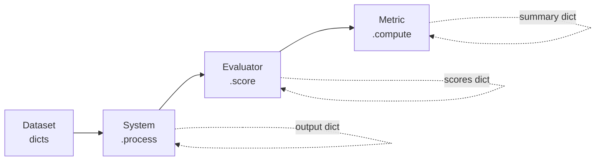

# context-bench

[](https://www.python.org/downloads/)
[](LICENSE)
[](https://github.com/npow/context-bench/actions/workflows/ci.yml)
[](https://github.com/psf/black)

**Benchmark any system that transforms LLM context.**

Prompt compressors, memory managers, context stuffers, RAG rerankers — if it touches the context window before an LLM sees it, context-bench measures how well it works and what it costs.

---

## Why context-bench?

You built (or bought) something that modifies LLM context. Now you need to answer:

- **Does compression destroy information?** Measure quality with F1, exact match, and pass rate against ground-truth QA datasets.
- **Is the cost worth it?** Track compression ratio and cost-per-successful-completion side by side.
- **Which approach wins?** Run multiple systems on the same dataset in one call and get a comparison table.

context-bench gives you a **single CLI command** (or Python `evaluate()` call) that runs your system against a dataset, scores every example, and aggregates the results — no boilerplate, no framework lock-in.

## Quick start

```bash
uv sync
```

Benchmark [Kompact](https://github.com/npow/kompact) in **one command**:

```bash
# Start your proxy
uv run kompact proxy --port 7878

# Benchmark it
context-bench --proxy http://localhost:7878 --dataset hotpotqa -n 50
```

Compare two proxies head-to-head:

```bash
context-bench \
  --proxy http://localhost:7878 --name kompact \
  --proxy http://localhost:8787 --name headroom \
  --dataset hotpotqa -n 50
```

Multiple datasets, JSON output, custom model:

```bash
context-bench \
  --proxy http://localhost:7878 \
  --dataset hotpotqa --dataset gsm8k \
  --model claude-sonnet-4-5-20250929 \
  --output json -n 100
```

Use a local JSONL file:

```bash
context-bench --proxy http://localhost:7878 --dataset ./my_data.jsonl
```

### CLI reference

| Flag | Default | Description |
|------|---------|-------------|
| `--proxy URL` | *(required)* | OpenAI-compatible proxy URL (repeatable) |
| `--name NAME` | hostname from URL | Display name for the proxy (repeatable, paired with `--proxy`) |
| `--dataset NAME` | *(required)* | Dataset name or `.jsonl` path (repeatable) |
| `--model MODEL` | `gpt-4` | Model name passed through to the proxy |
| `-n, --max-examples` | all | Limit examples per dataset |
| `--output {table,json,html}` | `table` | Output format |
| `--score-field` | `f1` | Score field from AnswerQuality for metrics |
| `--threshold` | `0.7` | Pass/fail threshold for PassRate and CostOfPass |
| `--judge-url URL` | *(none)* | OpenAI-compatible URL for LLM-as-judge scoring |
| `--judge-model` | `gpt-4` | Model name for the LLM judge |
| `--max-workers N` | sequential | Concurrent threads per system |
| `--cache-dir DIR` | *(none)* | Result cache directory (enables resume on re-run) |

Multi-config datasets accept a `:config` suffix, e.g. `--dataset mmlu:anatomy`, `--dataset mgsm:de`, `--dataset bbh:causal_judgement`.

### Example output

```
$ context-bench \
    --proxy http://localhost:9091 --name Baseline \
    --proxy http://localhost:7878 --name Kompact \
    --proxy http://localhost:7879 --name Headroom \
    --dataset bfcl --model haiku --score-field contains

# Evaluation Results

| System   | mean_score | pass_rate | compression_ratio | cost_of_pass |
|----------|-----------|-----------|-------------------|--------------|
| Baseline | 0.2930    | 0.2930    | -0.3264           | 4,291        |
| Kompact  | 0.3640    | 0.3640    | -0.1345           | 2,447        |
| Headroom | 0.3140    | 0.3140    | -0.1793           | 3,815        |

*1,431 examples evaluated*
```

### Python API

For full control, use the Python API directly:

```python
from context_bench import OpenAIProxy, evaluate
from context_bench.evaluators import AnswerQuality
from context_bench.metrics import MeanScore, PassRate, Latency

kompact = OpenAIProxy("http://localhost:7878", model="claude-sonnet-4-5-20250929", name="kompact")
result = evaluate(
    systems=[kompact],
    dataset=your_dataset,
    evaluators=[AnswerQuality()],
    metrics=[MeanScore(score_field="f1"), PassRate(score_field="f1"), Latency()],
    max_workers=4,           # concurrent execution
    cache_dir=".cache/",     # resume on re-run
)
print(result.summary)
```

## How it works



1. **Dataset** — any `Iterable[dict]`. Must have `"id"` and `"context"` keys.
2. **System** — implements `.name` and `.process(example) -> dict`. This is the thing you're benchmarking.
3. **Evaluator** — implements `.name` and `.score(original, processed) -> dict[str, float]`. Compares before/after.
4. **Metric** — implements `.name` and `.compute(rows) -> dict[str, float]`. Aggregates scores across examples.

All interfaces are [typing.Protocol](https://docs.python.org/3/library/typing.html#typing.Protocol) — implement the methods, don't subclass anything.

## Benchmark a proxy

The CLI wraps `OpenAIProxy` + `AnswerQuality` + sensible metrics. For custom evaluators or SDK-based systems, use the Python API.

### [Kompact](https://github.com/npow/kompact)

```bash
uv run kompact proxy --port 7878
context-bench --proxy http://localhost:7878 --dataset hotpotqa -n 50
```

### [Headroom](https://github.com/chopratejas/headroom)

```bash
pip install "headroom-ai[proxy]"
headroom proxy --port 8787
context-bench --proxy http://localhost:8787 --dataset hotpotqa -n 50
```

### Compare Kompact vs Headroom

```bash
context-bench \
  --proxy http://localhost:7878 --name kompact \
  --proxy http://localhost:8787 --name headroom \
  --dataset hotpotqa -n 50
```

### [Compresr](https://compresr.ai/)

Compresr uses a Python SDK instead of a proxy, so wrap it in a custom system:

```python
from compresr import CompressionClient

class CompresrSystem:
    name = "compresr"

    def __init__(self, api_key):
        self.client = CompressionClient(api_key=api_key)

    def process(self, example):
        compressed = self.client.generate(
            context=example["context"],
            question=example.get("question", ""),
        )
        return {**example, "context": compressed}
```

### Any OpenAI-compatible endpoint

```python
OpenAIProxy(
    base_url="http://localhost:8080",
    model="gpt-4",
    api_key="sk-...",              # or set OPENAI_API_KEY env var
    system_prompt="Be concise.",   # prepended as system message
    extra_body={"temperature": 0}, # any additional request params
)
```

### Export results

```python
result.to_json()          # JSON string
result.to_dataframe()     # pandas DataFrame (requires pandas)
result.filter(system="headroom")  # filter to one system
```

## Built-in datasets (42)

All HuggingFace datasets require `pip install -e ".[datasets]"` (or `uv sync --extra datasets`).

### QA & Reading Comprehension

| CLI name | Dataset | Notes |
|----------|---------|-------|
| `hotpotqa` | [HotpotQA](https://hotpotqa.github.io/) | Multi-hop QA |
| `natural-questions` | [Natural Questions](https://ai.google.com/research/NaturalQuestions) | Open-domain QA |
| `musique` | [MuSiQue](https://allenai.org/data/musique) | Multi-hop QA (answerable) |
| `narrativeqa` | [NarrativeQA](https://github.com/deepmind/narrativeqa) | Document summaries |
| `triviaqa` | [TriviaQA](https://nlp.cs.washington.edu/triviaqa/) | Search context QA |
| `frames` | [FRAMES](https://huggingface.co/datasets/google/frames-benchmark) | Multi-hop factual reasoning |
| `quality` | [QuALITY](https://github.com/nyu-mll/quality) | Long-document MC QA |
| `qasper` | [QASPer](https://allenai.org/data/qasper) | Scientific paper QA |

### Knowledge & Multiple Choice

| CLI name | Dataset | Notes |
|----------|---------|-------|
| `mmlu` | [MMLU](https://github.com/hendrycks/test) | 4-choice; configurable per-subject (`mmlu:anatomy`) |
| `mmlu-pro` | [MMLU-Pro](https://huggingface.co/datasets/TIGER-Lab/MMLU-Pro) | 10-choice harder variant |
| `arc-challenge` | [ARC-Challenge](https://allenai.org/data/arc) | Science exam questions |
| `truthfulqa` | [TruthfulQA](https://github.com/sylinrl/TruthfulQA) | Factuality (generation) |
| `gpqa` | [GPQA Diamond](https://arxiv.org/abs/2311.12022) | Graduate-level QA (gated) |
| `hellaswag` | [HellaSwag](https://rowanzellers.com/hellaswag/) | Commonsense completion |
| `winogrande` | [WinoGrande](https://winogrande.allenai.org/) | Coreference resolution |

### Reasoning & Math

| CLI name | Dataset | Notes |
|----------|---------|-------|
| `gsm8k` | [GSM8K](https://github.com/openai/grade-school-math) | Grade school math |
| `drop` | [DROP](https://allennlp.org/drop) | Discrete reasoning over paragraphs |
| `math` | [MATH](https://github.com/hendrycks/math) | Competition mathematics |
| `mgsm` | [MGSM](https://arxiv.org/abs/2210.03057) | Multilingual math; configurable (`mgsm:de`, `mgsm:ja`) |
| `bbh` | [BIG-Bench Hard](https://github.com/suzgunmirac/BIG-Bench-Hard) | 23 hard BIG-Bench tasks |

### Code Generation

| CLI name | Dataset | Notes |
|----------|---------|-------|
| `humaneval` | [HumanEval](https://github.com/openai/human-eval) | Execution-based (pass@1) |
| `mbpp` | [MBPP](https://github.com/google-research/google-research/tree/master/mbpp) | Execution-based (pass@1) |

### Summarization

| CLI name | Dataset | Notes |
|----------|---------|-------|
| `multi-news` | [Multi-News](https://github.com/Alex-Fabbri/Multi-News) | Multi-document |
| `dialogsum` | [DialogSum](https://github.com/cylnlp/dialogsum) | Dialogue |
| `qmsum` | [QMSum](https://github.com/Yale-LILY/QMSum) | Query-based meeting (via SCROLLS) |
| `summscreenfd` | [SummScreenFD](https://github.com/mingdachen/SummScreen) | TV transcript (via SCROLLS) |
| `meetingbank` | [MeetingBank](https://meetingbank.github.io/) | Meeting transcript |
| `govreport` | [GovReport](https://gov-report-data.github.io/) | Government reports |

### NLI & Fact Verification

| CLI name | Dataset | Notes |
|----------|---------|-------|
| `contract-nli` | [ContractNLI](https://stanfordnlp.github.io/contract-nli/) | Legal NLI (via SCROLLS) |
| `scifact` | [SciFact](https://github.com/allenai/scifact) | Scientific claim verification |

### Instruction Following

| CLI name | Dataset | Notes |
|----------|---------|-------|
| `ifeval` | [IFEval](https://arxiv.org/abs/2311.07911) | Programmatic constraint checking |
| `alpaca-eval` | [AlpacaEval](https://tatsu-lab.github.io/alpaca_eval/) | 805 instructions; best with `--judge-url` |

### Multi-Turn

| CLI name | Dataset | Notes |
|----------|---------|-------|
| `mt-bench` | [MT-Bench](https://arxiv.org/abs/2306.05685) | 80 two-turn conversations; uses `process_conversation()` |

### Long Context

| CLI name | Dataset | Notes |
|----------|---------|-------|
| `longbench` | [LongBench](https://github.com/THUDM/LongBench) | Configurable (`longbench:qasper`) |
| `longbench-v2` | [LongBench v2](https://github.com/THUDM/LongBench) | Harder variant |
| `infinitebench` | [InfiniteBench](https://github.com/OpenBMB/InfiniteBench) | 100K+ tokens |
| `nolima` | [NoLiMa](https://arxiv.org/abs/2502.05167) | Needle retrieval |

### Agent Traces

| CLI name | Dataset | Notes |
|----------|---------|-------|
| `bfcl` | [BFCL v3](https://gorilla.cs.berkeley.edu/leaderboard.html) | Function calling |
| `apigen` | [APIGen](https://huggingface.co/datasets/Salesforce/xlam-function-calling-60k) | Multi-turn tool use |
| `swebench` | [SWE-bench](https://www.swebench.com/) | Coding agent traces |
| `swebench-verified` | SWE-bench Verified | 500 validated problems |
| `swebench-lite` | SWE-bench Lite | 300 subset |

### Local Files

```bash
context-bench --proxy http://localhost:7878 --dataset ./my_data.jsonl
```

Any `list[dict]` with `"id"` and `"context"` keys works.

## Built-in evaluators (8)

Evaluators are auto-wired based on the datasets you select — no manual configuration needed.

| Evaluator | Auto-wired for | Scores |
|-----------|---------------|--------|
| `AnswerQuality` | All datasets | `f1`, `exact_match`, `recall`, `contains` |
| `SummarizationQuality` | Summarization datasets | `rouge_l_precision`, `rouge_l_recall`, `rouge_l_f1` |
| `MultipleChoiceAccuracy` | MC datasets (MMLU, ARC, GPQA, HellaSwag, WinoGrande, MMLU-Pro) | `mc_accuracy` |
| `CodeExecution` | HumanEval, MBPP | `pass_at_1` |
| `MathEquivalence` | MATH, GSM8K, MGSM | `math_equiv` (LaTeX normalization + numeric comparison) |
| `NLILabelMatch` | ContractNLI, SciFact | `nli_accuracy` |
| `IFEvalChecker` | IFEval | `ifeval_strict`, `ifeval_loose` (19 programmatic checks) |
| `LLMJudge` | Any (via `--judge-url`) | `judge_score` (1-5 scale normalized to 0-1) |

## Built-in metrics (7)

| Metric | What it measures |
|--------|------------------|
| `MeanScore` | Average score across all examples |
| `PassRate(threshold)` | Fraction of examples scoring above threshold |
| `CompressionRatio` | `1 - (output_tokens / input_tokens)` |
| `CostOfPass(threshold)` | Tokens spent per successful completion ([arXiv:2504.13359](https://arxiv.org/abs/2504.13359)) |
| `Latency` | Per-example timing: mean, median, p95, p99 |
| `PerDatasetBreakdown` | Mean score sliced by dataset (auto-enabled for multi-dataset runs) |
| `ParetoRank` | Rank on the quality-vs-cost Pareto frontier (auto-enabled for multi-system runs) |

Utility functions: `f1_score`, `exact_match`, `recall_score` (SQuAD-standard text comparison).

## Installation

```bash
# Core (just tiktoken)
uv sync

# With HuggingFace dataset loaders
uv sync --extra datasets

# Everything
uv sync --all-extras

# Development
uv sync --group dev
```

Requires **Python 3.10+** and [uv](https://docs.astral.sh/uv/).

## Running tests

```bash
uv run pytest
```

## Project structure

```
src/context_bench/
├── __main__.py          # CLI entry point (context-bench command)
├── __init__.py          # Public API: evaluate, EvalResult, EvalRow, OpenAIProxy
├── types.py             # Protocol definitions (System, Evaluator, Metric)
├── runner.py            # Core evaluate() orchestration (sequential + concurrent)
├── results.py           # EvalRow / EvalResult dataclasses
├── cache.py             # JSONL result caching for resumable runs
├── registry.py          # Plugin system for named components
├── systems/             # Built-in systems (OpenAIProxy, ClaudeCLI)
├── datasets/            # 42 dataset loaders (QA, MC, code, summarization, NLI, etc.)
├── evaluators/          # 8 evaluators (answer quality, MC, code exec, math, NLI, IFEval, ROUGE, LLM judge)
├── metrics/             # 7 metrics (mean, pass rate, compression, cost, latency, per-dataset, Pareto)
├── reporters/           # Markdown, JSON, and HTML output formatters
└── utils/tokens.py      # Pluggable tokenizer (default: tiktoken cl100k_base)
```

## CI/CD

This project uses GitHub Actions for continuous integration:

```yaml
# .github/workflows/ci.yml
name: CI
on:
  push:
    branches: [master, main]
  pull_request:
    branches: [master, main]
jobs:
  test:
    runs-on: ubuntu-latest
    strategy:
      matrix:
        python-version: ["3.10", "3.11", "3.12"]
    steps:
      - uses: actions/checkout@v4
      - uses: astral-sh/setup-uv@v5
      - run: uv python install ${{ matrix.python-version }}
      - run: uv sync --group dev
      - run: uv run pytest
```

## License

[MIT](LICENSE)
