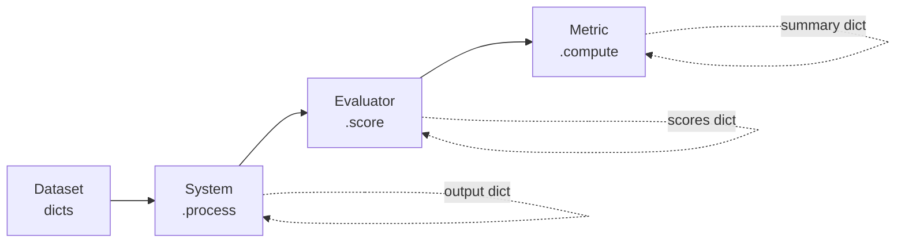

# context-bench

[](https://www.python.org/downloads/)
[](LICENSE)
[](https://github.com/npow/context-bench/actions/workflows/ci.yml)
[](https://github.com/psf/black)

**Benchmark any system that transforms LLM context.**

Prompt compressors, memory managers, context stuffers, RAG rerankers — if it touches the context window before an LLM sees it, context-bench measures how well it works and what it costs.

---

## Why context-bench?

You built (or bought) something that modifies LLM context. Now you need to answer:

- **Does compression destroy information?** Measure quality with F1, exact match, and pass rate against ground-truth QA datasets.
- **Is the cost worth it?** Track compression ratio and cost-per-successful-completion side by side.
- **Which approach wins?** Run multiple systems on the same dataset in one call and get a comparison table.

context-bench gives you a **single CLI command** (or Python `evaluate()` call) that runs your system against a dataset, scores every example, and aggregates the results — no boilerplate, no framework lock-in.

## Quick start

```bash
uv sync
```

Benchmark [Kompact](https://github.com/npow/kompact) in **one command**:

```bash
# Start your proxy
uv run kompact proxy --port 7878

# Benchmark it
context-bench --proxy http://localhost:7878 --dataset hotpotqa -n 50
```

Compare two proxies head-to-head:

```bash
context-bench \
  --proxy http://localhost:7878 --name kompact \
  --proxy http://localhost:8787 --name headroom \
  --dataset hotpotqa -n 50
```

Multiple datasets, JSON output, custom model:

```bash
context-bench \
  --proxy http://localhost:7878 \
  --dataset hotpotqa --dataset gsm8k \
  --model claude-sonnet-4-5-20250929 \
  --output json -n 100
```

Use a local JSONL file:

```bash
context-bench --proxy http://localhost:7878 --dataset ./my_data.jsonl
```

### CLI reference

| Flag | Default | Description |
|------|---------|-------------|
| `--proxy URL` | *(required)* | OpenAI-compatible proxy URL (repeatable) |
| `--name NAME` | hostname from URL | Display name for the proxy (repeatable, paired with `--proxy`) |
| `--dataset NAME` | *(required)* | Dataset name or `.jsonl` path (repeatable) |
| `--model MODEL` | `gpt-4` | Model name passed through to the proxy |
| `-n, --max-examples` | all | Limit examples per dataset |
| `--output {table,json}` | `table` | Output format |
| `--score-field` | `f1` | Score field from AnswerQuality for metrics |
| `--threshold` | `0.7` | Pass/fail threshold for PassRate and CostOfPass |

Known datasets: `hotpotqa`, `gsm8k`, `bfcl`, `apigen`, `swebench`, `swebench-verified`, `swebench-lite`.

### Python API

For full control, use the Python API directly:

```python
from context_bench import OpenAIProxy, evaluate
from context_bench.evaluators import AnswerQuality
from context_bench.metrics import MeanScore, PassRate

kompact = OpenAIProxy("http://localhost:7878", model="claude-sonnet-4-5-20250929", name="kompact")
result = evaluate(
    systems=[kompact],
    dataset=your_dataset,
    evaluators=[AnswerQuality()],
    metrics=[MeanScore(score_field="f1"), PassRate(score_field="f1")],
)
print(result.summary)
```

## How it works



1. **Dataset** — any `Iterable[dict]`. Must have `"id"` and `"context"` keys.
2. **System** — implements `.name` and `.process(example) -> dict`. This is the thing you're benchmarking.
3. **Evaluator** — implements `.name` and `.score(original, processed) -> dict[str, float]`. Compares before/after.
4. **Metric** — implements `.name` and `.compute(rows) -> dict[str, float]`. Aggregates scores across examples.

All interfaces are [typing.Protocol](https://docs.python.org/3/library/typing.html#typing.Protocol) — implement the methods, don't subclass anything.

## Benchmark a proxy

The CLI wraps `OpenAIProxy` + `AnswerQuality` + sensible metrics. For custom evaluators or SDK-based systems, use the Python API.

### [Kompact](https://github.com/npow/kompact)

```bash
uv run kompact proxy --port 7878
context-bench --proxy http://localhost:7878 --dataset hotpotqa -n 50
```

### [Headroom](https://github.com/chopratejas/headroom)

```bash
pip install "headroom-ai[proxy]"
headroom proxy --port 8787
context-bench --proxy http://localhost:8787 --dataset hotpotqa -n 50
```

### Compare Kompact vs Headroom

```bash
context-bench \
  --proxy http://localhost:7878 --name kompact \
  --proxy http://localhost:8787 --name headroom \
  --dataset hotpotqa -n 50
```

### [Compresr](https://compresr.ai/)

Compresr uses a Python SDK instead of a proxy, so wrap it in a custom system:

```python
from compresr import CompressionClient

class CompresrSystem:
    name = "compresr"

    def __init__(self, api_key):
        self.client = CompressionClient(api_key=api_key)

    def process(self, example):
        compressed = self.client.generate(
            context=example["context"],
            question=example.get("question", ""),
        )
        return {**example, "context": compressed}
```

### Any OpenAI-compatible endpoint

```python
OpenAIProxy(
    base_url="http://localhost:8080",
    model="gpt-4",
    api_key="sk-...",              # or set OPENAI_API_KEY env var
    system_prompt="Be concise.",   # prepended as system message
    extra_body={"temperature": 0}, # any additional request params
)
```

### Export results

```python
result.to_json()          # JSON string
result.to_dataframe()     # pandas DataFrame (requires pandas)
result.filter(system="headroom")  # filter to one system
```

## Built-in datasets

| Dataset | Domain | Loader | Install |
|---------|--------|--------|---------|
| [HotpotQA](https://hotpotqa.github.io/) | Multi-hop QA | `datasets.huggingface.hotpotqa()` | `pip install -e ".[datasets]"` |
| [GSM8K](https://github.com/openai/grade-school-math) | Math reasoning | `datasets.huggingface.gsm8k()` | `pip install -e ".[datasets]"` |
| [BFCL v3](https://gorilla.cs.berkeley.edu/leaderboard.html) | Function calling | `datasets.huggingface.bfcl_simple()` | `pip install -e ".[datasets]"` |
| [APIGen](https://huggingface.co/datasets/Salesforce/xlam-function-calling-60k) | Multi-turn tool use | `datasets.agent_traces.apigen_mt()` | `pip install -e ".[datasets]"` |
| [SWE-bench](https://www.swebench.com/) | Coding agent traces | `datasets.agent_traces.swebench()` | `pip install -e ".[datasets]"` |
| [SWE-bench Verified](https://www.swebench.com/) | Coding (500 validated) | `datasets.agent_traces.swebench_verified()` | `pip install -e ".[datasets]"` |
| [SWE-bench Lite](https://www.swebench.com/) | Coding (300 subset) | `datasets.agent_traces.swebench_lite()` | `pip install -e ".[datasets]"` |
| Local JSONL | Any | `datasets.local.load_jsonl(path)` | Core |

Or bring your own — any `list[dict]` with `"id"` and `"context"` keys works.

## Built-in metrics

| Metric | What it measures |
|--------|------------------|
| `MeanScore` | Average score across all examples |
| `PassRate(threshold)` | Fraction of examples scoring above threshold |
| `CompressionRatio` | `1 - (output_tokens / input_tokens)` |
| `CostOfPass(threshold)` | Tokens spent per successful completion ([arXiv:2504.13359](https://arxiv.org/abs/2504.13359)) |
| `ParetoRank` | Rank on the quality-vs-cost Pareto frontier |
| `f1_score`, `exact_match`, `recall_score` | SQuAD-standard text comparison utilities |

## Installation

```bash
# Core (just tiktoken)
uv sync

# With HuggingFace dataset loaders
uv sync --extra datasets

# Everything
uv sync --all-extras

# Development
uv sync --group dev
```

Requires **Python 3.10+** and [uv](https://docs.astral.sh/uv/).

## Running tests

```bash
uv run pytest
```

## Project structure

```
src/context_bench/
├── __main__.py          # CLI entry point (context-bench command)
├── __init__.py          # Public API: evaluate, EvalResult, EvalRow, OpenAIProxy
├── types.py             # Protocol definitions (System, Evaluator, Metric)
├── runner.py            # Core evaluate() orchestration
├── results.py           # EvalRow / EvalResult dataclasses
├── registry.py          # Plugin system for named components
├── systems/             # Built-in systems (OpenAIProxy)
├── datasets/            # Built-in dataset loaders
├── metrics/             # MeanScore, PassRate, CompressionRatio, CostOfPass, ParetoRank
├── reporters/           # Markdown and JSON output formatters
└── utils/tokens.py      # Pluggable tokenizer (default: tiktoken cl100k_base)
```

## CI/CD

This project uses GitHub Actions for continuous integration:

```yaml
# .github/workflows/ci.yml
name: CI
on:
  push:
    branches: [master, main]
  pull_request:
    branches: [master, main]
jobs:
  test:
    runs-on: ubuntu-latest
    strategy:
      matrix:
        python-version: ["3.10", "3.11", "3.12"]
    steps:
      - uses: actions/checkout@v4
      - uses: astral-sh/setup-uv@v5
      - run: uv python install ${{ matrix.python-version }}
      - run: uv sync --group dev
      - run: uv run pytest
```

## License

[MIT](LICENSE)
