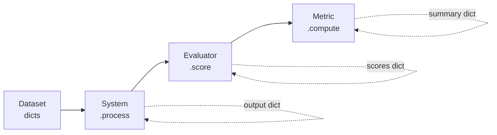

# context-bench

[](https://www.python.org/downloads/)
[](LICENSE)
[](https://github.com/npow/context-bench/actions/workflows/ci.yml)
[](https://github.com/psf/black)

**Benchmark any system that transforms LLM context — plus a memory system evaluation framework and an autoresearch loop.**

Prompt compressors, memory managers, context stuffers, RAG rerankers, stateful memory systems — if it touches the context window before an LLM sees it, context-bench measures how well it works and what it costs.

---

## Why context-bench?

- **Does compression destroy information?** Measure quality with F1, exact match, and pass rate against ground-truth QA datasets.
- **Is the cost worth it?** Track compression ratio and cost-per-successful-completion side by side.
- **Which approach wins?** Run multiple systems on the same dataset in one call and get a comparison table.
- **How good is your memory system?** Evaluate stateful memory (ingest → query) on LoCoMo and LongMemEval benchmarks with LLM-as-judge scoring.
- **Can an LLM improve the pipeline?** The autoresearch loop uses Claude to iteratively mutate and improve retrieval pipelines.

---

## Quick start

```bash
uv sync
```

### Benchmark a proxy

```bash
# Start your proxy
uv run kompact proxy --port 7878

# Benchmark it
context-bench --proxy http://localhost:7878 --dataset hotpotqa -n 50
```

### Compare two proxies head-to-head

```bash
context-bench \
  --proxy http://localhost:7878 --name kompact \
  --proxy http://localhost:8787 --name headroom \
  --dataset hotpotqa -n 50
```

### Evaluate memory systems

```bash
context-bench memory \
  --system naive --system embedding --system rlm \
  --relay http://localhost:18082 \
  --dataset locomo -n 10
```

### Multiple datasets, JSON output, custom model

```bash
context-bench \
  --proxy http://localhost:7878 \
  --dataset hotpotqa --dataset gsm8k \
  --model claude-sonnet-4-5-20250929 \
  --output json -n 100
```

### CLI reference

| Flag | Default | Description |
|------|---------|-------------|
| `--proxy URL` | *(required)* | OpenAI-compatible proxy URL (repeatable) |
| `--name NAME` | hostname from URL | Display name for the proxy (repeatable, paired with `--proxy`) |
| `--dataset NAME` | *(required)* | Dataset name or `.jsonl` path (repeatable) |
| `--model MODEL` | `gpt-4` | Model name passed through to the proxy |
| `-n, --max-examples` | all | Limit examples per dataset |
| `--output {table,json,html}` | `table` | Output format |
| `--score-field` | `f1` | Score field from AnswerQuality for metrics |
| `--threshold` | `0.7` | Pass/fail threshold for PassRate and CostOfPass |
| `--judge-url URL` | *(none)* | OpenAI-compatible URL for LLM-as-judge scoring |
| `--judge-model` | `gpt-4` | Model name for the LLM judge |
| `--max-workers N` | sequential | Concurrent threads per system |
| `--cache-dir DIR` | *(none)* | Result cache directory (enables resume on re-run) |

Multi-config datasets accept a `:config` suffix, e.g. `--dataset mmlu:anatomy`, `--dataset mgsm:de`, `--dataset bbh:causal_judgement`.

### Example output

```
$ context-bench \
    --proxy http://localhost:9091 --name Baseline \
    --proxy http://localhost:7878 --name Kompact \
    --proxy http://localhost:7879 --name Headroom \
    --dataset bfcl --model haiku --score-field contains

# Evaluation Results

| System   | mean_score | pass_rate | compression_ratio | cost_of_pass |
|----------|-----------|-----------|-------------------|--------------|
| Baseline | 0.2930    | 0.2930    | -0.3264           | 4,291        |
| Kompact  | 0.3640    | 0.3640    | -0.1345           | 2,447        |
| Headroom | 0.3140    | 0.3140    | -0.1793           | 3,815        |

*1,431 examples evaluated*
```

---

## How it works


```mermaid
flowchart LR
    D[Dataset<br/>dicts] --> S[System<br/>.process]
    S --> E[Evaluator<br/>.score]
    E --> M[Metric<br/>.compute]
    S -. output dict .-> S
    E -. scores dict .-> E
    M -. summary dict .-> M
```

1. **Dataset** — any `Iterable[dict]`. Must have `"id"` and `"context"` keys.
2. **System** — implements `.name` and `.process(example) -> dict`. This is the thing you're benchmarking.
3. **Evaluator** — implements `.name` and `.score(original, processed) -> dict[str, float]`. Compares before/after.
4. **Metric** — implements `.name` and `.compute(rows) -> dict[str, float]`. Aggregates scores across examples.

All interfaces are [typing.Protocol](https://docs.python.org/3/library/typing.html#typing.Protocol) — implement the methods, don't subclass anything.

### Python API

```python
from context_bench import OpenAIProxy, evaluate
from context_bench.evaluators import AnswerQuality
from context_bench.metrics import MeanScore, PassRate, Latency

kompact = OpenAIProxy("http://localhost:7878", model="claude-sonnet-4-5-20250929", name="kompact")
result = evaluate(
    systems=[kompact],
    dataset=your_dataset,
    evaluators=[AnswerQuality()],
    metrics=[MeanScore(score_field="f1"), PassRate(score_field="f1"), Latency()],
    max_workers=4,
    cache_dir=".cache/",
)
print(result.summary)
result.to_json()
result.to_dataframe()  # requires pandas
```

---

## Memory system evaluation

context-bench includes a dedicated framework for evaluating **stateful memory systems** — systems that ingest conversation history, documents, or events and answer questions about them.

### MemorySystem protocol

```python
from context_bench.memory_types import Item, IngestResult, QueryResult

class MemorySystem(Protocol):
    @property
    def name(self) -> str: ...
    def reset(self) -> None: ...
    def ingest(self, items: list[Item]) -> IngestResult: ...
    def query(self, question: str, budget: int | None = None) -> QueryResult: ...
```

The runner calls `reset()` between examples, `ingest()` to load items, then `query()` for each benchmark question.

### Item types (tagged union)

| Type | Fields | Use case |
|------|--------|----------|
| `ConversationTurn` | content, role, timestamp, speaker, session_id | Chat history |
| `DocumentChunk` | content, document_id, position, source | RAG documents |
| `PlatformEvent` | content, platform, timestamp, author, channel | Slack, Linear, Git events |
| `Declaration` | key, value, source_turn_id | User preferences, facts |

### Built-in memory systems

| System | Strategy | Dependencies |
|--------|----------|-------------|
| `NaiveMemorySystem` | Full conversation history stuffed into prompt | — |
| `EmbeddingSystem` | Semantic search via sentence-transformers | sentence-transformers |
| `RLMSystem` | Multi-strategy retrieval (semantic + keyword + entity) + LLM answering | lancedb, duckdb, sentence-transformers |
| `Mem0System` | Mem0 managed memory with relay routing | mem0ai |
| `ZepSystem` | Zep/Graphiti temporal knowledge graph | zep-python |

### Memory benchmarks

| CLI name | Dataset | Description |
|----------|---------|-------------|
| `locomo` | [LoCoMo](https://huggingface.co/datasets/snap-research/LoCoMo) | Long-conversation QA with temporal, multi-hop, and adversarial questions |
| `longmemeval` | [LongMemEval](https://huggingface.co/datasets/LongMemEval) | Multi-session memory QA |

### Running memory evaluation

```bash
# Compare naive, embedding, and RLM systems on LoCoMo
context-bench memory \
  --system naive --system embedding --system rlm \
  --relay http://localhost:18082 \
  --dataset locomo -n 10

# Standalone benchmark scripts
uv run python3 run_locomo_bench.py
uv run python3 run_longmemeval_m.py
```

### Memory-specific evaluators

| Evaluator | Scores | Description |
|-----------|--------|-------------|
| `MemoryJudge` | `judge_score` | LLM-as-judge for memory recall quality |
| `LLMJudgeLoCoMo` | `judge_score` | LoCoMo-specific scoring with evidence matching |
| `FalseMemoryRate` | `false_memory_rate` | Detects hallucinated/fabricated memories |

---

## Autoresearch loop

context-bench includes an **autoresearch loop** that uses Claude to iteratively improve a retrieval pipeline on long-conversation QA benchmarks.

### How it works

1. Start from a strong baseline pipeline (`sota_pipeline.py`)
2. An LLM (Claude Sonnet) reads the current pipeline source + score history
3. It proposes one **architectural improvement** (coreference resolution, temporal ranking, multi-hop retrieval, etc.)
4. The new pipeline is evaluated on held-out conversations
5. If F1 improves, the new pipeline becomes the baseline — otherwise revert
6. Repeat for N iterations

### Running the loop

```bash
uv run python3 loop.py \
  --relay http://localhost:18082 \
  --model sonnet \
  --dataset locomo \
  --iterations 50 \
  --eval-n 2 \
  --max-qa-per-conv 5 \
  --seed 42 \
  --output-dir loop_results/ \
  --pipeline-path src/context_bench/pipeline/sota_pipeline.py

# Resume after a crash
uv run python3 loop.py ... --resume
```

### loop.py flags

| Flag | Default | Description |
|------|---------|-------------|
| `--relay URL` | *(required)* | OpenAI-compatible relay URL |
| `--model NAME` | `sonnet` | Model for both mutation and answering |
| `--dataset NAME` | `locomo` | Dataset to optimize on |
| `--iterations N` | `50` | Max mutation iterations |
| `--eval-n N` | `2` | Number of conversations to evaluate per iteration |
| `--max-qa-per-conv N` | `5` | QA pairs sampled per conversation |
| `--seed N` | `42` | Random seed for reproducible splits |
| `--output-dir DIR` | *(required)* | Directory for results, checkpoints, logs |
| `--pipeline-path PATH` | *(required)* | Starting pipeline `.py` file |
| `--resume` | `False` | Resume from last checkpoint in `--output-dir` |

### Overnight watchdog

```bash
bash watchdog6.sh   # starts loop + relay, monitors for crashes/stalls
```

The watchdog checks every 10 minutes and restarts the loop with `--resume` if it crashes or stalls for >150 minutes.

### Starting pipelines

**`sota_pipeline.py`** — near-SOTA baseline implementing:
- Coreference resolution (pronouns/aliases → canonical names)
- Typed entity-relation-value triples with turn indices
- Per-entity aggregate profiles sorted by recency
- Query decomposition for multi-part questions
- Multi-hop retrieval across entity profiles
- Temporal ranking (recent vs historical facts)
- Embedding fallback via `all-MiniLM-L6-v2`

**`entity_pipeline.py`** — simpler entity-based pipeline (~19% F1 baseline).

### Output files

```
loop_results/
├── run.log              # full loop stdout (progress + scores)
├── watchdog.log         # watchdog heartbeat + restart events
├── relay.log            # relay server stdout
├── loop.pid             # PID of running loop process
├── loop_log.jsonl       # checkpoint: every iteration's score, mutation, accepted flag
├── baseline_score.json  # cached baseline to skip re-evaluation on restart
└── context_pipeline.py  # current best pipeline (updated when a mutation is accepted)
```

---

## DSPy optimizer benchmarking

context-bench integrates with [DSPy](https://dspy.ai) for optimizing query-structure-retrieval (QSR) pipelines:

```bash
uv sync --extra dspy

# Run QSR evaluation
uv run python -m context_bench.dspy_bench.qsr_eval

# Hyperparameter sweep
uv run python -m context_bench.dspy_bench.sweep
```

The DSPy module includes programs, feature extraction, train/val/test splits, compilation health checks, and a metrics bridge to context-bench's evaluation framework.

---

## Built-in datasets (42+)

All HuggingFace datasets require `uv sync --extra datasets`.

### QA & Reading Comprehension

| CLI name | Dataset | Notes |
|----------|---------|-------|
| `hotpotqa` | [HotpotQA](https://hotpotqa.github.io/) | Multi-hop QA |
| `natural-questions` | [Natural Questions](https://ai.google.com/research/NaturalQuestions) | Open-domain QA |
| `musique` | [MuSiQue](https://allenai.org/data/musique) | Multi-hop QA (answerable) |
| `narrativeqa` | [NarrativeQA](https://github.com/deepmind/narrativeqa) | Document summaries |
| `triviaqa` | [TriviaQA](https://nlp.cs.washington.edu/triviaqa/) | Search context QA |
| `frames` | [FRAMES](https://huggingface.co/datasets/google/frames-benchmark) | Multi-hop factual reasoning |
| `quality` | [QuALITY](https://github.com/nyu-mll/quality) | Long-document MC QA |
| `qasper` | [QASPer](https://allenai.org/data/qasper) | Scientific paper QA |

### Knowledge & Multiple Choice

| CLI name | Dataset | Notes |
|----------|---------|-------|
| `mmlu` | [MMLU](https://github.com/hendrycks/test) | 4-choice; configurable per-subject (`mmlu:anatomy`) |
| `mmlu-pro` | [MMLU-Pro](https://huggingface.co/datasets/TIGER-Lab/MMLU-Pro) | 10-choice harder variant |
| `arc-challenge` | [ARC-Challenge](https://allenai.org/data/arc) | Science exam questions |
| `truthfulqa` | [TruthfulQA](https://github.com/sylinrl/TruthfulQA) | Factuality (generation) |
| `gpqa` | [GPQA Diamond](https://arxiv.org/abs/2311.12022) | Graduate-level QA (gated) |
| `hellaswag` | [HellaSwag](https://rowanzellers.com/hellaswag/) | Commonsense completion |
| `winogrande` | [WinoGrande](https://winogrande.allenai.org/) | Coreference resolution |

### Reasoning & Math

| CLI name | Dataset | Notes |
|----------|---------|-------|
| `gsm8k` | [GSM8K](https://github.com/openai/grade-school-math) | Grade school math |
| `drop` | [DROP](https://allennlp.org/drop) | Discrete reasoning over paragraphs |
| `math` | [MATH](https://github.com/hendrycks/math) | Competition mathematics |
| `mgsm` | [MGSM](https://arxiv.org/abs/2210.03057) | Multilingual math; configurable (`mgsm:de`, `mgsm:ja`) |
| `bbh` | [BIG-Bench Hard](https://github.com/suzgunmirac/BIG-Bench-Hard) | 23 hard BIG-Bench tasks |

### Code Generation

| CLI name | Dataset | Notes |
|----------|---------|-------|
| `humaneval` | [HumanEval](https://github.com/openai/human-eval) | Execution-based (pass@1) |
| `mbpp` | [MBPP](https://github.com/google-research/google-research/tree/master/mbpp) | Execution-based (pass@1) |

### Summarization

| CLI name | Dataset | Notes |
|----------|---------|-------|
| `multi-news` | [Multi-News](https://github.com/Alex-Fabbri/Multi-News) | Multi-document |
| `dialogsum` | [DialogSum](https://github.com/cylnlp/dialogsum) | Dialogue |
| `qmsum` | [QMSum](https://github.com/Yale-LILY/QMSum) | Query-based meeting (via SCROLLS) |
| `summscreenfd` | [SummScreenFD](https://github.com/mingdachen/SummScreen) | TV transcript (via SCROLLS) |
| `meetingbank` | [MeetingBank](https://meetingbank.github.io/) | Meeting transcript |
| `govreport` | [GovReport](https://gov-report-data.github.io/) | Government reports |

### NLI & Fact Verification

| CLI name | Dataset | Notes |
|----------|---------|-------|
| `contract-nli` | [ContractNLI](https://stanfordnlp.github.io/contract-nli/) | Legal NLI (via SCROLLS) |
| `scifact` | [SciFact](https://github.com/allenai/scifact) | Scientific claim verification |

### Instruction Following

| CLI name | Dataset | Notes |
|----------|---------|-------|
| `ifeval` | [IFEval](https://arxiv.org/abs/2311.07911) | Programmatic constraint checking |
| `alpaca-eval` | [AlpacaEval](https://tatsu-lab.github.io/alpaca_eval/) | 805 instructions; best with `--judge-url` |

### Multi-Turn

| CLI name | Dataset | Notes |
|----------|---------|-------|
| `mt-bench` | [MT-Bench](https://arxiv.org/abs/2306.05685) | 80 two-turn conversations; uses `process_conversation()` |

### Long Context

| CLI name | Dataset | Notes |
|----------|---------|-------|
| `longbench` | [LongBench](https://github.com/THUDM/LongBench) | Configurable (`longbench:qasper`) |
| `longbench-v2` | [LongBench v2](https://github.com/THUDM/LongBench) | Harder variant |
| `infinitebench` | [InfiniteBench](https://github.com/OpenBMB/InfiniteBench) | 100K+ tokens |
| `nolima` | [NoLiMa](https://arxiv.org/abs/2502.05167) | Needle retrieval |

### Memory

| CLI name | Dataset | Notes |
|----------|---------|-------|
| `locomo` | [LoCoMo](https://huggingface.co/datasets/snap-research/LoCoMo) | Long-conversation QA (temporal, multi-hop, adversarial) |
| `longmemeval` | [LongMemEval](https://huggingface.co/datasets/LongMemEval) | Multi-session memory QA |

### Agent Traces

| CLI name | Dataset | Notes |
|----------|---------|-------|
| `bfcl` | [BFCL v3](https://gorilla.cs.berkeley.edu/leaderboard.html) | Function calling |
| `apigen` | [APIGen](https://huggingface.co/datasets/Salesforce/xlam-function-calling-60k) | Multi-turn tool use |
| `swebench` | [SWE-bench](https://www.swebench.com/) | Coding agent traces |
| `swebench-verified` | SWE-bench Verified | 500 validated problems |
| `swebench-lite` | SWE-bench Lite | 300 subset |

### Local Files

```bash
context-bench --proxy http://localhost:7878 --dataset ./my_data.jsonl
```

---

## Built-in evaluators (11)

Evaluators are auto-wired based on the datasets you select.

| Evaluator | Auto-wired for | Scores |
|-----------|---------------|--------|
| `AnswerQuality` | All datasets | `f1`, `exact_match`, `recall`, `contains` |
| `SummarizationQuality` | Summarization datasets | `rouge_l_precision`, `rouge_l_recall`, `rouge_l_f1` |
| `MultipleChoiceAccuracy` | MC datasets (MMLU, ARC, GPQA, HellaSwag, WinoGrande, MMLU-Pro) | `mc_accuracy` |
| `CodeExecution` | HumanEval, MBPP | `pass_at_1` |
| `MathEquivalence` | MATH, GSM8K, MGSM | `math_equiv` |
| `NLILabelMatch` | ContractNLI, SciFact | `nli_accuracy` |
| `IFEvalChecker` | IFEval | `ifeval_strict`, `ifeval_loose` |
| `LLMJudge` | Any (via `--judge-url`) | `judge_score` (1-5 scale → 0-1) |
| `MemoryJudge` | Memory benchmarks | `judge_score` |
| `LLMJudgeLoCoMo` | LoCoMo | `judge_score` (with evidence matching) |
| `FalseMemoryRate` | Memory benchmarks | `false_memory_rate` |

## Built-in metrics (7)

| Metric | What it measures |
|--------|------------------|
| `MeanScore` | Average score across all examples |
| `PassRate(threshold)` | Fraction of examples scoring above threshold |
| `CompressionRatio` | `1 - (output_tokens / input_tokens)` |
| `CostOfPass(threshold)` | Tokens spent per successful completion ([arXiv:2504.13359](https://arxiv.org/abs/2504.13359)) |
| `Latency` | Per-example timing: mean, median, p95, p99 |
| `PerDatasetBreakdown` | Mean score sliced by dataset (auto-enabled for multi-dataset runs) |
| `ParetoRank` | Rank on the quality-vs-cost Pareto frontier (auto-enabled for multi-system runs) |

---

## Built-in systems (9)

| System | Type | Description |
|--------|------|-------------|
| `OpenAIProxy` | Context | Wraps any OpenAI-compatible proxy endpoint |
| `ClaudeCLI` | Context | Uses the `claude` CLI tool |
| `NaiveSystem` | Context | Baseline — stuffs full context into prompt |
| `NaiveMemorySystem` | Memory | Full conversation history as prompt |
| `EmbeddingSystem` | Memory | Semantic search via sentence-transformers |
| `RLMSystem` | Memory | Multi-strategy retrieval (semantic + keyword + entity) + LLM answering |
| `Mem0System` | Memory | Mem0 managed memory integration |
| `ZepSystem` | Memory | Zep/Graphiti temporal knowledge graph |
| `HostInterpreter` | Code | Sandboxed code execution for tool-use benchmarks |

---

## Cookbook

### Run a quick smoke test

```bash
context-bench --proxy http://localhost:7878 --dataset hotpotqa -n 10
```

### Full evaluation with LLM judge and caching

```bash
context-bench \
  --proxy http://localhost:7878 --name my-system \
  --dataset hotpotqa --dataset mmlu --dataset gsm8k \
  --judge-url http://localhost:9090 \
  --cache-dir .bench-cache/ \
  --max-workers 8 \
  --output html -n 200 > report.html
```

### Compare systems on multiple-choice benchmarks

```bash
context-bench \
  --proxy http://localhost:7878 --name kompact \
  --proxy http://localhost:8787 --name baseline \
  --dataset mmlu --dataset arc-challenge --dataset hellaswag \
  --score-field mc_accuracy -n 100
```

### Benchmark code generation with execution

```bash
context-bench \
  --proxy http://localhost:7878 \
  --dataset humaneval --dataset mbpp \
  --score-field pass_at_1 --threshold 1.0
```

### Evaluate math with LaTeX-aware scoring

```bash
context-bench \
  --proxy http://localhost:7878 \
  --dataset math --dataset gsm8k --dataset mgsm:en \
  --score-field math_equiv
```

### Resume an interrupted run

```bash
# First run — gets interrupted
context-bench --proxy http://localhost:7878 --dataset mmlu \
  --cache-dir .cache/ -n 1000

# Re-run — picks up where it left off
context-bench --proxy http://localhost:7878 --dataset mmlu \
  --cache-dir .cache/ -n 1000
```

### Custom system (Python API)

```python
from context_bench import evaluate
from context_bench.evaluators import AnswerQuality, MathEquivalence
from context_bench.metrics import MeanScore, Latency, PerDatasetBreakdown

class MyCompressor:
    name = "my-compressor"
    def process(self, example):
        compressed = my_compress(example["context"])
        return {**example, "context": compressed, "response": compressed}

result = evaluate(
    systems=[MyCompressor()],
    dataset=my_data,
    evaluators=[AnswerQuality(), MathEquivalence()],
    metrics=[MeanScore(score_field="f1"), Latency(), PerDatasetBreakdown(score_field="f1")],
    max_workers=4,
    cache_dir=".cache/",
)
print(result.to_json())
```

### Custom memory system

```python
from context_bench.memory_types import Item, IngestResult, QueryResult, ConversationTurn

class MyMemory:
    name = "my-memory"

    def reset(self):
        self.history = []

    def ingest(self, items: list[Item]) -> IngestResult:
        self.history.extend(items)
        return IngestResult(num_items=len(items), latency_ms=0)

    def query(self, question: str, budget: int | None = None) -> QueryResult:
        context = "\n".join(
            item.content for item in self.history
            if isinstance(item, ConversationTurn)
        )
        answer = call_my_llm(question, context)
        return QueryResult(answer=answer, total_latency_ms=0)
```

---

## Installation

```bash
# Core (tiktoken + sentence-transformers)
uv sync

# With HuggingFace dataset loaders
uv sync --extra datasets

# With Mem0 integration
uv sync --extra mem0

# With Zep integration
uv sync --extra zep

# With DSPy optimizer
uv sync --extra dspy

# Everything
uv sync --all-extras

# Development
uv sync --group dev
```

Requires **Python 3.10+** and [uv](https://docs.astral.sh/uv/).

## Running tests

```bash
uv run pytest
```

## Project structure

```
src/context_bench/
├── __main__.py          # CLI entry point (context-bench command)
├── __init__.py          # Public API: evaluate, EvalResult, EvalRow, OpenAIProxy
├── types.py             # Protocol definitions (System, Evaluator, Metric)
├── memory_types.py      # Memory protocol + typed items (ConversationTurn, etc.)
├── runner.py            # Core evaluate() orchestration (sequential + concurrent)
├── memory_runner.py     # Memory system evaluate_memory() orchestration
├── results.py           # EvalRow / EvalResult dataclasses
├── cache.py             # JSONL result caching for resumable runs
├── registry.py          # Plugin system for named components
├── embeddings.py        # Embedding utilities
├── systems/             # 9 systems (OpenAIProxy, ClaudeCLI, Naive, RLM, Embedding, Mem0, Zep, ...)
├── datasets/            # 42+ dataset loaders (QA, MC, code, summarization, NLI, memory, ...)
│   └── memory/          # LoCoMo + LongMemEval loaders
├── evaluators/          # 11 evaluators (answer quality, MC, code exec, math, NLI, IFEval, ROUGE, LLM judge, memory judge, ...)
├── metrics/             # 7 metrics (mean, pass rate, compression, cost, latency, per-dataset, Pareto)
├── reporters/           # Markdown, JSON, and HTML output formatters
├── loop/
│   └── mutator.py       # LLM-driven pipeline mutator for autoresearch
├── dspy_bench/          # DSPy optimizer integration (QSR eval, sweep, programs)
└── utils/tokens.py      # Pluggable tokenizer (default: tiktoken cl100k_base)

pipeline/                # Standalone pipeline files (used by autoresearch loop)
├── entity_pipeline.py   # Structured entity-fact pipeline (~19% F1 baseline)
└── sota_pipeline.py     # Near-SOTA pipeline: coreference + triples + temporal ranking
```

## License

[MIT](LICENSE)
